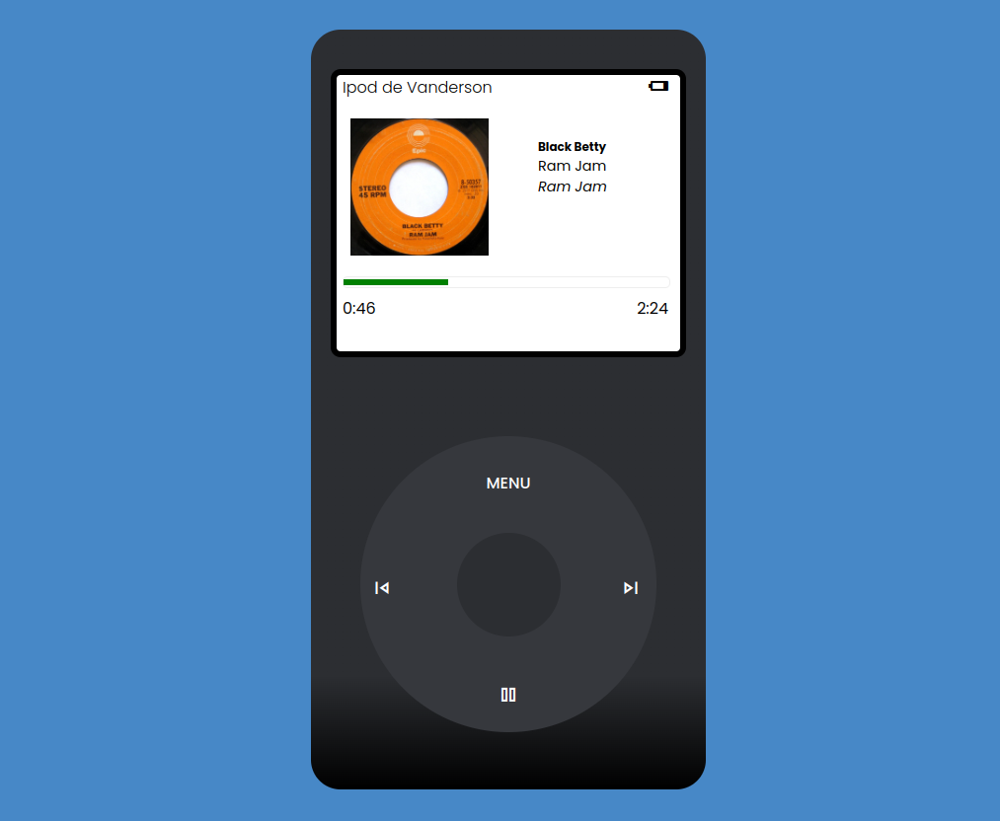

# Desenvolvedor Front End - Projeto Final

## Uma página web que simula um iPod.

[https://storied-daifuku-41f959.netlify.app/](https://storied-daifuku-41f959.netlify.app/)

**HTML**

`<!DOCTYPE **html**>`

Essa linha informa ao navegador que o documento é escrito em HTML.

**2. Elemento `html`:**

**HTML**

`<html lang="pt-br">`

Define o documento como HTML e define o idioma como português do Brasil ("pt-br").

**3. Elemento `head`:**

**HTML**

`<head>
    ...
</head>`

Esta seção contém informações sobre a página que não são exibidas diretamente pelo navegador, mas são importantes para seu funcionamento.

- **Meta charset:**

**HTML**

    `<meta charset="UTF-8">`

Define a codificação de caracteres como UTF-8, permitindo a exibição correta de caracteres acentuados.

- **Meta compatibilidade:**

**HTML**

    `<meta http-equiv="X-UA-Compatible" content="IE=edge">`

Ajuda na compatibilidade com navegadores antigos, como o Internet Explorer.

- **Meta viewport:**

**HTML**

    `<meta name="viewport" content="width=device-width, initial-scale=1.0">`

Configura a responsividade da página, permitindo que ela se ajuste a diferentes tamanhos de tela.

- **Links para fontes:**

**HTML**

    `<link rel="stylesheet" href="https://fonts.googleapis.com/css2?family=Material+Symbols+Outlined:opsz,wght,FILL,GRAD@20..48,100..700,0..1,-50..200"    />
    <link rel="stylesheet" href="https://fonts.googleapis.com/css2?family=Material+Symbols+Outlined:opsz,wght,FILL,GRAD@24,400,0,0"    />
    <link rel="preconnect" href="https://fonts.googleapis.com">
    <link rel="preconnect" href="https://fonts.gstatic.com" crossorigin>
    <link href="https://fonts.googleapis.com/css2?family=Poppins:ital,wght@0,100;0,200;0,300;0,400;0,500;0,600;0,700;0,800;0,900;1,100;1,200;1,300;1,400;1,500;1,600;1,700;1,800;1,900&display=swap"    rel="stylesheet">`

Carrega fontes externas do Google Fonts para serem usadas na página. Material Symbols e Poppins são as fontes utilizadas.

- **Título da página:**

**HTML**

    `<title>Projeto Final Desenvolvimento Front End - SENAI</title>`

Define o título da página que aparece na aba do navegador.

**4. Elemento `body`:**

**HTML**

`<body>
    ...
</body>`

Esta seção contém o conteúdo principal da página que será exibido pelo navegador.

- **Elementos de layout:**
    - `header` (cabeçalho) - Provavelmente será preenchido no futuro para incluir elementos como logo ou botões.
    - `div.container` (recipiente) - Define uma área principal para agrupar os elementos do iPod.
        - `div.tela` (tela) - Representa a tela do iPod.
            - `div.barra-status` (barra de status) - Exibe o nome do dono ("Ipod de Vanderson") e o ícone de bateria fraca.
            - `div.capa-album` (capa do álbum) - Mostra a imagem da capa do álbum.
            - `div.nome-musica` (nome da música) - Exibe o título da música ("Black Betty"), o artista ("Ram Jam") e o álbum (também "Ram Jam").
            - `div.duracao` (duração) - Representa o progresso da música.
                - `div.barra` (barra) - Barra de progresso (vazia no código atual).
                - `div.tempo` (tempo) - Mostra o tempo decorrido e restante da música (ambos zerados no código atual).
        - `div.divisao` (divisão) - Possivelmente separa a tela dos controles.
        - `div.btn-circular` (botão circular) -

## **Explicação do código CSS**

Este código CSS estiliza o iPod

**1. Estilização global:**

**CSS**

- `{ padding: 0; margin: 0; font-family: "Poppins";
}`
- ``: Seleciona todos os elementos.
- `padding: 0; margin: 0;`: Remove os espaços internos e externos dos elementos.
- `font-family: "Poppins";`: Define a fonte padrão como "Poppins".

**2. Estilização do corpo:**

**CSS**

`body {
    background-color: #4788c7;
    margin: auto;
    max-width: 400px;
}`

- `background-color: #4788c7;`: Define a cor de fundo do corpo.
- `margin: auto;`: Centraliza o conteúdo horizontalmente.
- `max-width: 400px;`: Limita a largura máxima do corpo.

**3. Estilização do cabeçalho:**

**CSS**

`header{
    padding-bottom: 50px;
}`

- Adiciona um espaçamento inferior de 50 pixels ao cabeçalho.

**4. Estilização do container:**

**CSS**

`.container{
    position: relative;
    background-color: #2c2e32;
    border-radius: 30px;
    max-width: 400px;
    height: 700px;
    padding: 35px 0 35px 0;
    margin: auto;
    background-image: linear-gradient(
        #2c2e32 85%,
        black
    );
}`

- Define a posição relativa para posicionar elementos dentro dele.
- Define a cor de fundo, o raio de borda, a largura máxima, a altura, o preenchimento e a margem do container.
- Aplica um gradiente de cor ao fundo.

**5. Estilização da tela:**

**CSS**

`.tela{
    margin: auto;
    margin-top: 5px;
    background-color: white;
    max-width: 87%;
    height: 40%;
    border-radius: 10px;
    color: black;
    border: 6px solid black;
}`

- Centraliza a tela e adiciona um espaçamento superior.
- Define a cor de fundo, a largura máxima, a altura, o raio de borda, a cor do texto e a borda da tela.

**6. Estilização da barra de status:**

**CSS**

`.barra-status{
    background-color: transparent;
    height: 30px;
    border-top-left-radius: 10px;
    border-top-right-radius: 10px;
}

.barra-status h4{
    position: absolute;
    top: 46px;
    left: 8%;
    font-weight: 300;
}`

- Define a cor de fundo, a altura e o raio de borda da barra de status.
- Posiciona o texto do nome do dono absolutamente dentro da barra.

**7. Estilização da barra de progresso:**

**CSS**

`.barra {
    width: 330px;
    height: 10px;
    border: 1px solid #eee;
    border-radius: 5px;
    display: flex;
    align-items: center;
    justify-content: flex-start;
    position: absolute;
    top: 250px;
    left: 8%;
}

progress {
    height: 6px;
    width: 50%;
    background-color: #eee;
}`

- Define a largura, a altura, a borda, o raio de borda, o posicionamento e a exibição da barra.
- Estiliza o elemento `progress` dentro da barra.

**8. Estilização do tempo:**

**CSS**

`.tempo {
    position: absolute;
    top: 270px;
    left: 8%;
    display: flex;
    width: 330px;
    justify-content: space-between;
}`

- Define a posição, a exibição e a distribuição dos elementos de tempo.

**9. Estilização dos ícones:**

**CSS**

`.material-symbols-outlined{
    position: absolute;
    top: 46px;
    left: 85%;
}

.tela .material-symbols-outlined{
    position: absolute;
    right: 20%;
}`

- Posiciona os ícones absolutamente.

**10. Estilização da capa do álbum:**

**CSS**

`.capa-album img{
    position: absolute;
    top: 90px;
    left: 40px;
    width: 140px;
}`

- Posiciona e define o tamanho da imagem da capa do álbum.

**11. Estilização do nome da música:**

**CSS**

`.nome-musica{
    position: absolute;
    font-size: 0.9em;
    top: 110px;
    left: 230px;
}`

- Posiciona e define o tamanho da fonte do nome da música.

**12. Estilização da divisão:**

**CSS**

`.divisao{
    height: 80px;
}`

- Define a altura da divisão.

**13. Estilização dos botões circulares:**

**CSS**

`.btn-circular{
    margin: auto;
    display: grid;
    place-items: center;
    border-radius: 50%;
    background-color: #36383d;
    width: 300px;
    height: 300px;
    font-weight: 500;
    color: white;
}`

- Centraliza os botões, define a exibição em grid, o raio de borda, a cor de fundo, a largura, a altura, o peso da fonte e a cor do texto.

**14. Estilização dos ícones dentro dos botões:**

**CSS**

`.btn-central{
    position: absolute;
    top: auto;
    background-color: #2c2e32;
    border-radius: 50%;
    width: 105px;
    height: 105px;
}
.btn-circular .btn-menu{
    position: absolute;
    top: 58%;
}

.btn-circular .btn-play{
    position: absolute;
    top: 80%;
    left: 47%;
}
.btn-circular .btn-pause{
    position: absolute;
    top: 80%;
    left: 47%;
}
.btn-pause{
    display: none;
}
.btn-circular .btn-anterior{
    position: absolute;
    top: 66%;
    left:15%;
}
.btn-circular .btn-proximo{
    position: absolute;
    top: 66%;
    right: 22%;
}`

- Posiciona os botões dentro do botão circular.
- Oculta o botão de pausa inicialmente.

**15. Estilização para dispositivos menores:**

**CSS**

`@media (max-width: 375px) and (max-height: 667px) {
    // Estilos específicos para dispositivos menores
}`

- Define estilos específicos para dispositivos com largura máxima de 375 pixels e altura máxima de 667 pixels.

Este código CSS completo define a aparência visual do iPod, incluindo a disposição dos elementos, as cores, as fontes e o posicionamento.

## **Explicação do código JavaScript**

Este código JavaScript controla o funcionamento do simulador de iPod.

**1. Array de músicas:**

**JavaScript**

`let musicas = [
    // Objetos contendo informações de cada música
];`

- Define um array chamado `musicas` que armazena objetos contendo informações de cada música, como título, artista, álbum, caminho do arquivo de áudio e caminho da imagem da capa.

**2. Variáveis:**

**JavaScript**

`let musica = document.querySelector('audio');
let duracaoMusica = document.querySelector('.fim');
let imagem = document.querySelector('img');
let nomeMusica = document.querySelector('.nome-musica    h5');
let nomeArtista = document.querySelector('.nome-musica i');
let nomeAlbum = document.querySelector('.nome-musica p');
let indexMusica = 0;`

- `musica`: Seleciona o elemento `audio` do HTML, que representa o player de áudio.
- `duracaoMusica`: Seleciona o elemento que exibe a duração total da música.
- `imagem`: Seleciona o elemento `img` que exibe a capa do álbum.
- `nomeMusica`: Seleciona o elemento `h5` dentro da classe `.nome-musica` que exibe o título da música.
- `nomeArtista`: Seleciona o elemento `i` dentro da classe `.nome-musica` que exibe o artista da música.
- `nomeAlbum`: Seleciona o elemento `p` dentro da classe `.nome-musica` que exibe o álbum da música.
- `indexMusica`: Define um índice para controlar a música tocando atualmente (inicia em 0).

**3. Eventos:**

- `play-pause`: Adiciona um evento de clique para a função `tocarMusica` quando o botão play/pause é clicado.
- `btn-pause`: Adiciona um evento de clique para a função `pauseMusica` quando o botão de pausa é clicado.
- `timeupdate`: Adiciona um evento para a função `atualizarBarra` toda vez que o tempo de reprodução da música muda.
- `loadedmetadata`: Adiciona um evento para definir a duração total da música e atualizar as informações da música atual quando o carregamento é concluído.
- `btn-anterior`: Adiciona um evento de clique para a função que toca a música anterior.
- `btn-proximo`: Adiciona um evento de clique para a função que toca a próxima música.

**4. Funções:**

- `redenrizarMusica(index)`: Carrega a música especificada pelo índice no array `musicas`.
    - Atualiza o atributo `src` do elemento `audio` com o caminho do arquivo de áudio da música selecionada.
    - Define eventos para atualizar as informações da música (título, artista, álbum, capa) e a duração total quando o carregamento termina.
- `tocarMusica()`: Inicia a reprodução da música.
    - Exibe o botão de pausa e oculta o botão de play.
- `pauseMusica()`: Pausa a reprodução da música.
    - Exibe o botão de play e oculta o botão de pausa.
- `atualizarBarra()`: Atualiza a barra de progresso de acordo com o tempo decorrido da música.
    - Calcula a porcentagem de tempo decorrido em relação à duração total.
    - Define a largura da barra de progresso de acordo com a porcentagem calculada.
    - Atualiza o elemento que exibe o tempo decorrido da música.
- `segundosParaMinutos(segundos)`: Converte segundos para o formato minutos:segundos.
    - Calcula os minutos e segundos a partir do valor de segundos.
    - Formata a exibição dos segundos com um zero à esquerda caso seja menor que 10.
    - Retorna a string no formato minutos:segundos.

### **MENU HTML:**

1. **Cabeçalho (Head):**
    - O `<meta charset="UTF-8">` define a codificação de caracteres para UTF-8, que é uma forma comum de garantir que todos os caracteres especiais da língua portuguesa, como acentos e cedilhas, sejam corretamente exibidos.
    - O `<meta name="viewport" content="width=device-width, initial-scale=1.0">` garante que a página seja responsiva em diferentes dispositivos, ajustando o layout para caber em telas menores.
    - Há links para folhas de estilo (`css/style.css`) e fontes do Google Fonts, incluindo fontes como "Poppins" e ícones da biblioteca "Material Symbols Outlined".
    - O título da página é definido como "Projeto Final Desenvolvimento Front End - SENAI".
2. **Estrutura do Corpo (Body):**
    - O `header` está vazio, provavelmente servindo como um espaço reservado para futuros conteúdos ou um menu superior.
    - O `
` envolve a maior parte do conteúdo principal da página.
    - Dentro desse container, há a `tela`, que parece ser o elemento principal, com:
        - Uma imagem de fundo (``).
        - Uma `barra-status` contendo o nome "Ipod" e um ícone de bateria (`battery_low`), usando a fonte Material Symbols.
        - A `opcoes`, que é uma lista de opções de menu com itens como "Músicas", "Vídeos", "Fotos", etc.
    - Há uma divisão (`

`) que pode estar relacionada ao estilo, separando elementos visualmente.
    - Abaixo, a estrutura dos botões circulares é definida, que incluem:
        - Botões para navegação: "MENU", "Anterior", "Próximo", "Play/Pause" e "Pause".
    - O `<audio>` no final do `body` define um áudio que será reproduzido, com o arquivo "Ram Jam - Black Betty.mp3".
3. **Scripts:**
    - O script `menu.js` é incluído no final da página, que gerencia a interação com o menu e a troca de imagens de fundo.

---

### **MENU JavaScript:**

Este código JavaScript interage com a interface HTML, especialmente os botões e a troca de imagens. A função principal é controlar o comportamento ao clicar nos itens do menu e alterar o fundo da tela conforme a opção selecionada.

1. **Declaração de Variáveis:**
    - `imagens` é um array de objetos contendo o caminho para diferentes imagens de fundo. No entanto, essas imagens não estão sendo usadas diretamente no código atual.
    - `imagem` é uma referência ao elemento HTML que contém a imagem de fundo, selecionado através de `document.querySelector('.fundo')`.
    - `indexImagem` é uma variável que controla o índice atual da imagem a ser exibida, iniciando em 0.
2. **Eventos de Clique nos Itens do Menu:**
    - O código adiciona ouvintes de eventos (event listeners) para cada item do menu. Cada vez que um item é clicado, a imagem de fundo (`imagem.src`) é alterada para uma nova imagem relacionada ao item do menu. Por exemplo:
        - Clicar em "Musicas" muda a imagem de fundo para `'assets/img/Music.webp'`.
        - Clicar em "Videos" muda a imagem de fundo para `'assets/img/Film Wallpaper Top Background.png'`, e assim por diante.
3. **Função `redenrizarBackground`:**
    - A intenção seria alterar o fundo com base em um índice (`indexImagem`).
    - O trecho que usa o `addEventListener('loadedmetadata', ...)` também parece não ter muito sentido aqui, já que ele está tentando aguardar o carregamento do metadado da imagem, o que não faz sentido para uma imagem estática.

---

### **Considerações Finais:**

- O HTML configura uma interface de usuário básica, parecida com um reprodutor de mídia (como o iPod), com imagens de fundo e controles para tocar música.
- O JavaScript permite a interação do usuário com o menu, mudando as imagens de fundo conforme o item selecionado no menu.
- A função `redenrizarBackground` parece estar incompleta ou não é necessária para o funcionamento atual, já que as mudanças de imagem já são tratadas diretamente nos ouvintes de evento.
